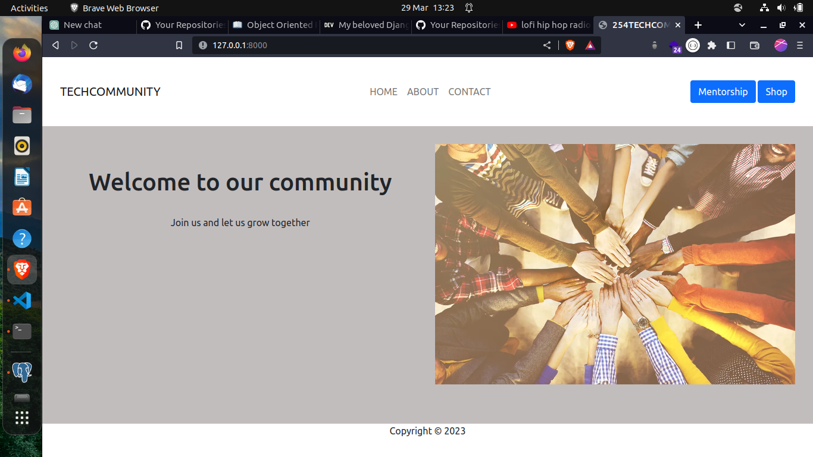

# PLP-project


## Description
This is repo for my PLP project 
I tackled a solution to build a tech community where newbies can get mentors and help.

## Installation
```
git clone https://github.com/CyrusNchege/PLP-project
```

```
cd PLP-project
```
Create a virtual environment using command `python3 -m venv env`

Activate environment `source env/bin/activate`

```
pip install -r requirements.txt
```
make migrations
```
python manage.py makemigrations
python manage.py migrate
```
** Runserver**
```
python manage.py runserver
```



